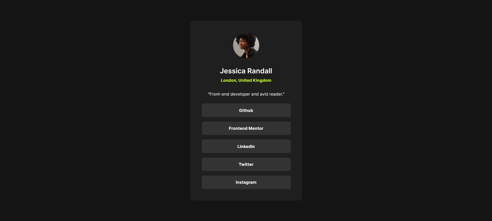

# Frontend Mentor - Social links profile solution

This is a solution to the [Social links profile challenge on Frontend Mentor](https://www.frontendmentor.io/challenges/social-links-profile-UG32l9m6dQ). Frontend Mentor challenges help you improve your coding skills by building realistic projects.

## Table of contents

- [Overview](#overview)
  - [The challenge](#the-challenge)
  - [Screenshot](#screenshot)
  - [Links](#links)
- [My process](#my-process)
  - [Built with](#built-with)
  - [What I learned](#what-i-learned)
  - [Continued development](#continued-development)
  - [Useful resources](#useful-resources)
- [Author](#author)

## Overview

### The challenge

Users should be able to:

- See hover and focus states for all interactive elements on the page

### Screenshot



### Links

- Solution URL: [click here](https://github.com/ashap-bappy/social-links-profile-main)
- Live Site URL: [click here](https://ashap-bappy.github.io/social-links-profile-main/)

## My process

### Built with

- Semantic HTML5 markup
- CSS custom properties
- Flexbox

### What I learned

I learned how to work with this project without a figma file. I had to trust my instinct. I also learned uses of display: block because when I styled the li elements it was not clickable, then I had to search and make it clickable. I also used css custom properties and learned about root elements and before and after psuedo elements.

```css
.links ul li a {
  display: block;
  padding: 1.2rem 7.8rem;
  text-decoration: none;
  color: var(--clr-white);
  font-size: 1.2rem;
  font-weight: var(--fw-bold);
}
```

### Continued development

In the future projects I want to be able to continue development like this and want to explore new css properties.

### Useful resources

- [PX to REM converter](https://nekocalc.com/px-to-rem-converter) - This helped me for converting PX values to REM. I really liked this website and will use it going forward.
- [PerfectPixel](https://chromewebstore.google.com/detail/perfectpixel-by-welldonec/dkaagdgjmgdmbnecmcefdhjekcoceebi?hl=en) - This helped me for making my design perfect. I really liked this extension and will use it going forward.

## Author

- Frontend Mentor - [@ashap-bappy](https://www.frontendmentor.io/profile/ashap-bappy)
- Facebook - [Ashap Bappy](https://www.facebook.com/ashap.bappy.7)
